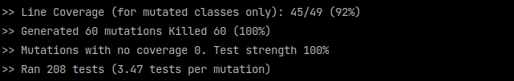

Implementation of `StringUtil.contains()`
------------------------------------------
The task was to implement the `StringUtil.contains(String string, String pattern)` method to take two
input parameters. The method must verify if the first parameter contains a pattern passed
as the second parameter.

Implementation cannot use any standard library or third party utility methods operating
on strings (`String.matches()`, `String.contains()`, `String.indexOf()`, etc.) or regular expressions.
Methods like `String.toCharArray()`, `String.charAt()`, `String.length()`, `String.substring()`, etc. are allowed to use.

Alternative approach
-------
During my work on this assignment, I've developed two, closely related solutions. I prefer the first one (available in `StringUtil.contains()`), for its straightforwardness, however the second one (`StringUtilAlt.contains()`) is slightly more concise.

Mutation tests
-------
Mutation testing has confirmed the 100% effectiveness and strength of unit tests:  
  
For a more detailed analysis, please refer to [/target/pit-reports/index.html](/target/pit-reports/index.html) after running `mvn clean test`.
